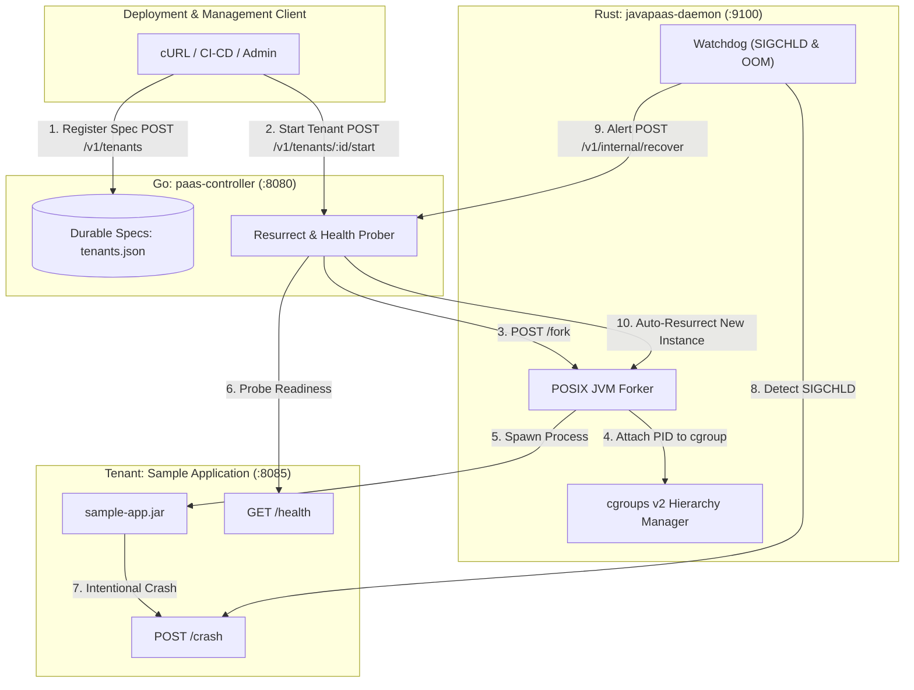

# 🚀 Deploying JavaPaaS with Sample Application

This guide provides step-by-step instructions for deploying the **JavaPaaS** platform and running the guest **Sample Application** on Linux.

It covers two deployment paths:
1. **Quickstart / Local Development Mode** (zero root privileges required, runs on local mock cgroups).
2. **Production Bare-Metal Deployment** (kernel-enforced cgroups v2, systemd sandboxed services).

---

## 📋 Prerequisites

Ensure your host meets the following requirements:

| Dependency | Minimum Version | Purpose |
| :--- | :--- | :--- |
| **Linux OS** | Kernel 5.4+ | cgroups v2 unified hierarchy support |
| **Java JDK** | 17+ or 21+ | Compiling and executing guest JVM tenant applications |
| **Rust / Cargo**| 1.75+ | Compiling `javapaas-daemon` |
| **Go** | 1.22+ | Compiling `paas-controller` |
| **Utilities** | `curl`, `jq` | API interaction, readiness probing, JSON parsing |

Check toolchain availability:
```bash
java -version
javac -version
cargo --version
go version
```

---

## 🏗️ Architecture & Flow



---

## ⚡ Option 1: Quickstart / Local Testing Mode

Use this mode for local development, CI testing, or environments without root access to `/sys/fs/cgroup`.

### Step 1: Automated 1-Command Execution
Run the automated end-to-end verification script:

```bash
./scripts/test_sample_e2e.sh
```

This script builds the sample application JAR, compiles the daemon and controller, boots both services in an isolated temporary runtime, registers the tenant, verifies health probing, executes live tier resizing, induces an intentional crash, and validates automated recovery!

---

### Step 2: Manual Step-by-Step Local Deployment

#### 1. Build the Sample Application
```bash
./sample-app/build.sh
```
*Output artifact:* `sample-app/target/sample-app.jar`

#### 2. Compile Daemon and Controller
```bash
# Compile Rust daemon
cargo build --release

# Compile Go controller
cd paas-controller && go build -o ../target/release/paas-controller . && cd ..
```

#### 3. Start the PaaS Controller
In a dedicated terminal:
```bash
./target/release/paas-controller \
    -listen="127.0.0.1:8080" \
    -daemon-url="http://127.0.0.1:9100" \
    -state-file="/tmp/javapaas-tenants.json" \
    -auth-token="secret-token-123"
```

#### 4. Start the PaaS Daemon
In another dedicated terminal:
```bash
CGROUP_ROOT="/tmp/javapaas-cgroups" \
LISTEN_ADDR="127.0.0.1:9100" \
CONTROLLER_URL="http://127.0.0.1:8080" \
AUTH_TOKEN="secret-token-123" \
NODE_ID="node-local" \
./target/release/javapaas-daemon
```

Verify service health:
```bash
curl -i http://127.0.0.1:8080/health
curl -i http://127.0.0.1:9100/health
```

---

## 🏢 Option 2: Production Bare-Metal Deployment (systemd)

For production servers running systemd and real cgroups v2.

### Step 1: Run Deployment Script
The repository provides an automated installation script [`scripts/deploy.sh`](file:///home/naveen/Projects/JavaPaaS/scripts/deploy.sh):

```bash
sudo ./scripts/deploy.sh
```

This script:
1. Creates directory trees `/opt/javapaas/bin` and `/opt/javapaas/data`.
2. Creates an unprivileged system user `javapaas`.
3. Compiles production release binaries for both Rust and Go.
4. Generates systemd service units with sandboxing (`ProtectSystem=strict`, `NoNewPrivileges=true`).

### Step 2: Configure System Services

Enable and launch the systemd units:
```bash
sudo systemctl daemon-reload
sudo systemctl enable --now javapaas-daemon.service
sudo systemctl enable --now javapaas-controller.service
```

### Step 3: Verify Service Status
```bash
systemctl status javapaas-daemon.service
systemctl status javapaas-controller.service
```

Inspect service logs:
```bash
journalctl -u javapaas-daemon.service -f
journalctl -u javapaas-controller.service -f
```

---

## 📦 Deploying & Managing the Sample Application

Now that the JavaPaaS control plane and daemon are running, deploy the guest application.

Set convenience environment variables:
```bash
CONTROLLER="http://127.0.0.1:8080"
AUTH_HEADER="Authorization: Bearer secret-token-123"
JAR_PATH="$(pwd)/sample-app/target/sample-app.jar"
```

---

### Step 1: Register Tenant Specification
Register the sample app tenant with the controller:

```bash
curl -s -X POST "$CONTROLLER/v1/tenants" \
  -H "$AUTH_HEADER" \
  -H "Content-Type: application/json" \
  -d '{
    "tenant_id": "sample-tenant",
    "node_id": "node-local",
    "java_version": "21",
    "tier": "silver",
    "jar_path": "'"$JAR_PATH"'",
    "extra_args": ["--port=8085", "--name=OrderService"],
    "health_check_port": 8085,
    "health_check_path": "/health"
  }' | jq .
```

*Expected output:*
```json
{
  "status": "registered",
  "tenant_id": "sample-tenant",
  "spec": {
    "node_id": "node-local",
    "java_version": "21",
    "tier": "silver",
    "jar_path": ".../sample-app/target/sample-app.jar",
    "extra_args": ["--port=8085", "--name=OrderService"],
    "health_check_path": "/health",
    "health_check_port": 8085
  }
}
```

---

### Step 2: Start the Tenant & Verify Readiness Probing
Instruct the controller to spawn the tenant and verify its health:

```bash
curl -s -X POST "$CONTROLLER/v1/tenants/sample-tenant/start" \
  -H "$AUTH_HEADER" | jq .
```

*Expected output:*
```json
{
  "success": true,
  "new_pid": 116316,
  "latency_ms": 149
}
```

Verify that the application is running and inspect its internal runtime metrics:
```bash
curl -s http://127.0.0.1:8085/health | jq .
curl -s http://127.0.0.1:8085/info | jq .
```

---

### Step 3: Live Tier Resizing (Dynamic Resource Scaling)
Scale the tenant vertically from **Silver** (1 GB Heap, 1 Core CFS) to **Gold** (4 GB Heap, 2 Cores CFS) without restarting the process:

```bash
curl -s -X PUT "$CONTROLLER/v1/tenants/sample-tenant/resize" \
  -H "$AUTH_HEADER" \
  -H "Content-Type: application/json" \
  -d '{"tier": "gold"}' | jq .
```

*Expected output:*
```json
{
  "status": "resized",
  "tenant_id": "sample-tenant",
  "tier": "gold"
}
```

---

### Step 4: Chaos Testing & Automated Recovery
Induce a crash on the running tenant to verify automated resurrection:

```bash
# Trigger immediate process crash
curl -s -X POST http://127.0.0.1:8085/crash
```

Observe the daemon and controller logs. Within milliseconds:
1. The guest process terminates.
2. The daemon's `SIGCHLD` handler catches the exit event.
3. The daemon dispatches a recovery alert to `POST /v1/internal/recover`.
4. The controller resurrector forks a replacement JVM and verifies readiness on port `8085`.

Verify recovery by querying the health endpoint again:
```bash
curl -s http://127.0.0.1:8085/health | jq .
```
Notice that the PID has changed, uptime has reset, and status is `UP`!

---

### Step 5: CPU and Memory Stress Testing

#### Test CPU Throttling:
```bash
# Stress all CPU cores for 5 seconds
curl -s -X POST "http://127.0.0.1:8085/stress-cpu?duration=5" | jq .
```

#### Test Memory Allocation:
```bash
# Retain 200 MB in heap
curl -s -X POST "http://127.0.0.1:8085/stress-memory?mb=200" | jq .
```

---

### Step 6: Querying Platform Metrics
Both components export Prometheus-compatible metrics for monitoring:

```bash
# Rust Daemon Metrics (cgroup limits, memory usage, OOM counts)
curl -s http://127.0.0.1:9100/metrics

# Go Controller Metrics (registered tenants, recovery counts, latency)
curl -s http://127.0.0.1:8080/metrics
```

---

### Step 7: Clean Teardown
Stop the tenant process:
```bash
curl -s -X POST "$CONTROLLER/v1/tenants/sample-tenant/stop" \
  -H "$AUTH_HEADER" | jq .
```

Delete the tenant registration:
```bash
curl -s -X DELETE "$CONTROLLER/v1/tenants/sample-tenant" \
  -H "$AUTH_HEADER" | jq .
```

---

## 🛠️ Troubleshooting

| Issue | Likely Cause | Solution |
| :--- | :--- | :--- |
| `Java executable not found` | JDK not installed or not in PATH | Export `JAVA_HOME=/path/to/jdk` or install OpenJDK (`sudo apt install openjdk-21-jdk`). |
| `failed to create cgroup dir` | Non-root user writing to `/sys/fs/cgroup` | Set `CGROUP_ROOT=/tmp/javapaas-cgroups` for development, or grant permissions with `sudo chown -R $USER /sys/fs/cgroup/javapaas`. |
| `401 Unauthorized` | Missing or mismatched token | Ensure requests include `-H "Authorization: Bearer <token>"`. |
| `Readiness probe failed` | Port mismatch or slow application boot | Verify `health_check_port` in `TenantSpec` matches the application port passed in `extra_args`. |
| `409 Conflict` | Tenant already running | Call `POST /v1/tenants/{id}/stop` before starting again. |
