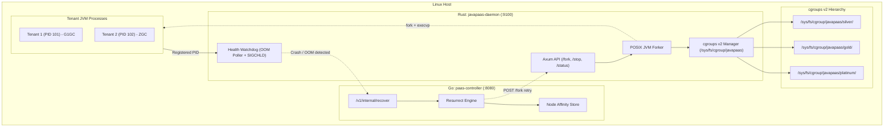

# ☕ JavaPaaS

**JavaPaaS** is a high-density, multi-tenant Platform-as-a-Service (PaaS) engine designed specifically for running, isolating, and automatically resurrecting Java Virtual Machine (JVM) microservices and applications on bare-metal and Linux hosts.

It combines a low-level **Rust daemon** leveraging Linux **cgroups v2** and POSIX process controls with a **Go orchestration controller** for automated fault recovery and node affinity management.

---

## 🏛️ Architecture Overview



---

## 🌟 Key Features

* **Kernel-Native Isolation with cgroups v2:** Creates isolated hierarchical control groups per tier and tenant with strict memory ceilings (`memory.max`), zero-swap enforcement (`memory.swap.max = 0`), and group OOM termination (`memory.oom.group = 1`).
* **Direct POSIX JVM Forking:** Replaces heavy container runtimes by using direct POSIX `fork()` and `execvp()` system calls, attaching process IDs directly to `/sys/fs/cgroup/.../cgroup.procs` before executing the JVM.
* **Multi-Tiered JVM & Garbage Collector Profiles:** Automatically assigns tuned heap allocations and modern garbage collectors (G1GC, ZGC, Generational ZGC) based on the assigned service tier.
* **Sub-Second Auto-Resurrection:** Dual-engine watchdog combining a 1-second `memory.events` OOM poller and an asynchronous Linux `SIGCHLD` signal handler with non-blocking `waitpid(WNOHANG)`.
* **Zero-Downtime Controller Handshake:** When a crash occurs, the watchdog immediately reports to `paas-controller`, which fetches the tenant spec from the affinity store and re-forks the tenant with exponential backoff.

---

## 📊 Tier Specifications

JavaPaaS defines standardized performance and memory tiers out of the box:

| Tier | Heap Min (`-Xms`) | Heap Max (`-Xmx`) | Garbage Collector & Flags | cgroup `memory.max` | Swap Limit |
| :--- | :--- | :--- | :--- | :--- | :--- |
| **Silver** | `256m` | `1g` | `-XX:+UseG1GC` | **1.25 GB** (`1,342,177,280` B) | `0` (Disabled) |
| **Gold** | `1g` | `4g` | `-XX:MaxGCPauseMillis=200 -XX:+UseZGC` | **4.25 GB** (`4,563,402,752` B) | `0` (Disabled) |
| **Platinum**| `4g` | `32g` | `-XX:+UseZGC -XX:+ZGenerational` | **32.25 GB** (`34,628,173,824` B)| `0` (Disabled) |

---

## 🧩 Components

### 1. `javapaas-daemon` (Rust)
* **Location:** `src/`
* **Port:** `9100` (configurable via `LISTEN_ADDR`)
* **Responsibilities:**
  * Initializing `/sys/fs/cgroup/javapaas` with `+cpu +memory +io` controllers.
  * Resolving JDK binaries from `/opt/jdk/{version}/bin/java` or system PATH.
  * Forking and executing JARs with tier-specific JVM flags.
  * Watching child processes and cgroup OOM events to trigger recovery alerts.

### 2. `paas-controller` (Go)
* **Location:** `paas-controller/`
* **Port:** `8080` (configurable via `-listen`)
* **Responsibilities:**
  * Serving the recovery endpoint (`POST /v1/internal/recover`).
  * Maintaining tenant specifications and node assignments via thread-safe `NodeAffinityStore`.
  * Coordinating multi-attempt (up to 3 tries) tenant resurrection through the daemon's `/fork` API.

---

## ⚙️ System Requirements & Kernel Setup

JavaPaaS requires a modern Linux distribution with **cgroups v2 unified hierarchy** enabled.

### 1. Kernel Parameter Optimization
Run the setup script with root privileges to apply required memory overcommit, swappiness, and PID limits:

```bash
sudo ./scripts/setup-kernel.sh
```

This configures and persists the following in `/etc/sysctl.d/99-javapaas.conf`:
* `vm.swappiness = 0` (prevent paging JVM heap to disk)
* `vm.overcommit_memory = 1` (allow JVM virtual address space reservations)
* `kernel.pid_max = 4194304`
* `fs.file-max = 2097152`

### 2. cgroups v2 Verification
Ensure cgroups v2 is mounted at `/sys/fs/cgroup`:

```bash
stat -fc %T /sys/fs/cgroup/
# Output should be: cgroup2fs
```

---

## 🚀 Build & Installation

### Prerequisites
* **Rust:** 1.75+ (`cargo`)
* **Go:** 1.22+ (`go`)
* **Java:** JDK 17, 21, etc. installed at `/opt/jdk/<version>/bin/java` or available in `$PATH`.
* **Root Privileges:** Required for cgroup management and process signals.

### 1. Automated Build & Service Installation
Run the deployment script:

```bash
sudo ./scripts/deploy.sh
```

This builds the release binaries into `/opt/javapaas/bin/` and creates systemd unit files:
* `/opt/javapaas/bin/javapaas-daemon`
* `/opt/javapaas/bin/paas-controller`
* `/etc/systemd/system/javapaas-daemon.service`
* `/etc/systemd/system/javapaas-controller.service`

### 2. Start Services via Systemd
```bash
sudo systemctl daemon-reload
sudo systemctl enable --now javapaas-daemon javapaas-controller
```

### 3. Verify Health
```bash
# Check Daemon
curl http://localhost:9100/health
# {"status":"ok"}

# Check Controller
curl http://localhost:8080/health
# {"status":"ok"}
```

---

## 🛠️ Manual / Development Run

If running locally for testing or development:

```bash
# Terminal 1: Run Controller (Go)
cd paas-controller
go run . -listen :8080 -daemon-url http://localhost:9100

# Terminal 2: Run Daemon (Rust with root permissions for cgroups)
sudo RUST_LOG=info \
     NODE_ID=node-1 \
     LISTEN_ADDR=0.0.0.0:9100 \
     CONTROLLER_URL=http://localhost:8080 \
     cargo run
```

---

## 📡 API Reference

### Rust Daemon (`:9100`)

#### 1. Fork Tenant JVM
* **Endpoint:** `POST /fork`
* **Request:**
  ```json
  {
    "tenant_id": "tenant-alpha",
    "tier": "gold",
    "java_version": "21",
    "jar_path": "/var/apps/service.jar",
    "extra_args": ["--server.port=8081"]
  }
  ```
* **Response (200 OK):**
  ```json
  {
    "tenant_id": "tenant-alpha",
    "pid": 48291,
    "status": "running"
  }
  ```

#### 2. Tenant Status
* **Endpoint:** `GET /status/{tenant_id}`
* **Response:**
  ```json
  {
    "tenant_id": "tenant-alpha",
    "pid": 48291,
    "tier": "gold",
    "status": "running"
  }
  ```

#### 3. Stop Tenant
* **Endpoint:** `POST /stop/{tenant_id}`
* **Response:**
  ```json
  {
    "tenant_id": "tenant-alpha",
    "pid": 0,
    "status": "stopped"
  }
  ```

---

### Go Controller (`:8080`)

#### Recover / Resurrect Tenant (Internal)
* **Endpoint:** `POST /v1/internal/recover`
* **Request (sent by Rust Watchdog):**
  ```json
  {
    "tenant_id": "tenant-alpha",
    "tier": "gold",
    "node_id": "node-1",
    "reason": "OOM_KILL",
    "exit_code": null,
    "timestamp": "2026-09-13T09:00:00Z"
  }
  ```
* **Response:**
  ```json
  {
    "success": true,
    "new_pid": 48310,
    "latency_ms": 142
  }
  ```

---

## 📁 Repository Structure

```
├── Cargo.toml               # Rust workspace & daemon dependencies
├── Cargo.lock
├── src/                     # Rust Daemon Source
│   ├── main.rs              # Daemon entry point & Tokio runtime
│   ├── api.rs               # Axum HTTP routes (/fork, /stop, /status)
│   ├── cgroups.rs           # cgroups v2 controller management
│   ├── config.rs            # Tier configurations (Silver, Gold, Platinum)
│   ├── jvm_forker.rs        # POSIX fork & execvp JVM execution
│   ├── watchdog.rs          # OOM event poller & SIGCHLD reaper
│   └── error.rs             # Error types
├── paas-controller/         # Go Controller Source
│   ├── go.mod
│   ├── main.go              # Controller CLI entry point
│   ├── server.go            # HTTP multiplexer & handlers
│   ├── resurrect.go         # Automatic recovery logic with retries
│   ├── affinity.go          # In-memory node affinity store
│   └── types.go             # Shared event and request data types
└── scripts/                 # Operational Scripts
    ├── setup-kernel.sh      # sysctl kernel parameter tuning
    └── deploy.sh            # Automated compilation & systemd unit setup
```

---

## 📄 License

This project is licensed under the Apache 2.0 or MIT License.
