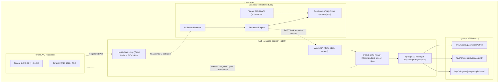

# ☕ JavaPaaS

**JavaPaaS** is a high-density, multi-tenant Platform-as-a-Service (PaaS) engine designed specifically for running, isolating, and automatically resurrecting Java Virtual Machine (JVM) microservices and applications on bare-metal and Linux hosts.

It combines a low-level **Rust daemon** leveraging Linux **cgroups v2** and POSIX process controls with a **Go orchestration controller** for automated fault recovery, tenant persistence, and node affinity management.

---

## 🏛️ Architecture Overview



---

## 🚀 Quickstart & Deployment

For a comprehensive walkthrough of deploying JavaPaaS in both local development and production environments, see the [**Complete Deployment Guide (DEPLOYMENT.md)**](DEPLOYMENT.md).

### 1-Command Automated E2E Test
Test the full lifecycle (compilation, tenant registration, readiness health probing, live tier resizing, crash induction, and auto-resurrection) with a single command:

```bash
./scripts/test_sample_e2e.sh
```

### Build & Run the Sample App Standalone
```bash
./sample-app/build.sh
java -jar sample-app/target/sample-app.jar --port=8085
curl http://127.0.0.1:8085/health
```

---

## 🌟 Key Features

* **Kernel-Native Isolation with cgroups v2:** Creates isolated hierarchical control groups per tier and tenant before process spawn, with strict memory ceilings (`memory.max`), zero-swap enforcement (`memory.swap.max = 0`), and group OOM termination (`memory.oom.group = 1`). Subtree control is propagated through both root and tier levels.
* **Safe JVM Forking & Error Pipes:** Spawns JVM processes using `std::process::Command` with async-signal-safe `pre_exec` cgroup attachment and automatic error pipe reporting, preventing multi-threaded allocator deadlocks and reporting setup failures directly to the caller.
* **Multi-Tiered JVM & Garbage Collector Profiles:** Automatically assigns tuned heap allocations and modern garbage collectors (G1GC, ZGC, Generational ZGC) based on the assigned service tier.
* **Crash De-duplication & Lifecycle Tracking:** Tenant status state machine (`Running`, `Recovering`, `Stopping`, `Stopped`, `Exited`) that prevents double-reporting between the periodic OOM poller and the asynchronous `SIGCHLD` handler, and suppresses spurious recovery during manual stops.
* **Durable Tenant Specifications:** Go controller provides full tenant CRUD APIs (`/v1/tenants`) backed by atomic file-based persistence (`tenants.json`).
* **Live Cgroup Re-Sizing:** Dynamically updates memory and CPU quotas (`PUT /resize/{id}`) on active JVMs without interrupting runtime execution.
* **Application Readiness Probing:** Validates guest JVM health endpoints (e.g. `/health` or `/actuator/health`) before marking resurrections as healthy, with automatic rollback if probes fail.
* **Linux Process Sandboxing:** Child processes are secured via `PR_SET_NO_NEW_PRIVS` and `PR_SET_DUMPABLE = 0`, preventing privilege escalation and ptrace memory tampering.
* **Multi-Node Cluster Routing:** Intelligent node registry maps tenant affinity to specific bare-metal hosts across a distributed fleet.
* **Authenticated APIs & Hardened Deployment:** Support for bearer token authorization (`AUTH_TOKEN`), localhost binding by default (`127.0.0.1`), unprivileged controller daemon execution (`User=javapaas`), and systemd security sandboxing (`NoNewPrivileges`, `ProtectSystem=strict`, `PrivateTmp`).

---

## 📊 Tier Specifications

JavaPaaS defines standardized performance and memory tiers out of the box:

| Tier | Heap Min (`-Xms`) | Heap Max (`-Xmx`) | Garbage Collector & Flags | cgroup `memory.max` | Swap Limit | cgroup `cpu.max` |
| :--- | :--- | :--- | :--- | :--- | :--- | :--- |
| **Silver** | `256m` | `1g` | `-XX:+UseG1GC` | **1.25 GB** (`1,342,177,280` B) | `0` (Disabled) | `100000 100000` (1 Core) |
| **Gold** | `1g` | `4g` | `-XX:MaxGCPauseMillis=200 -XX:+UseZGC` | **4.25 GB** (`4,563,402,752` B) | `0` (Disabled) | `200000 100000` (2 Cores) |
| **Platinum**| `4g` | `32g` | `-XX:+UseZGC -XX:+ZGenerational` | **32.25 GB** (`34,628,173,824` B)| `0` (Disabled) | `400000 100000` (4 Cores) |

---

## 🧩 Components

### 1. `javapaas-daemon` (Rust)
* **Location:** `src/`
* **Default Listen:** `127.0.0.1:9100` (configurable via `LISTEN_ADDR`)
* **Responsibilities:**
  * Initializing `/sys/fs/cgroup/javapaas` with `+cpu +memory +io` controllers across root and tier levels.
  * Resolving JDK binaries from `/opt/jdk/{version}/bin/java`, system `$PATH`, or standard fallback directories.
  * Creating tenant cgroups with strict memory/swap limits prior to spawning JVM processes.
  * Watching child processes and cgroup OOM events to trigger deduplicated recovery alerts.

### 2. `paas-controller` (Go)
* **Location:** `paas-controller/`
* **Default Listen:** `127.0.0.1:8080` (configurable via `-listen`)
* **Responsibilities:**
  * Managing tenant specifications and node assignments via `/v1/tenants` with durable JSON storage (`-state-file`).
  * Serving the recovery endpoint (`POST /v1/internal/recover`) with concurrent recovery deduplication.
  * Coordinating multi-attempt (up to 3 tries) tenant resurrection through the daemon's `/fork` API.
  * Graceful shutdown on `SIGINT`/`SIGTERM` to drain active recoveries.

---

## ⚙️ System Requirements & Kernel Setup

JavaPaaS requires a modern Linux distribution with **cgroups v2 unified hierarchy** enabled.

### 1. Kernel Parameter Optimization
Run the setup script with root privileges:

```bash
sudo ./scripts/setup-kernel.sh
```

This configures and persists the following in `/etc/sysctl.d/99-javapaas.conf`:
* `vm.swappiness = 0` (prevent paging JVM heap to disk)
* `vm.overcommit_memory = 1` (allow JVM virtual address space reservations)
* `kernel.pid_max = 4194304`
* `fs.file-max = 2097152`

### 2. cgroups v2 Verification
Ensure cgroups v2 is mounted at `/sys/fs/cgroup`:

```bash
stat -fc %T /sys/fs/cgroup/
# Output should be: cgroup2fs
```

---

## 🚀 Build & Installation

### Prerequisites
* **Rust:** 1.75+ (`cargo`)
* **Go:** 1.22+ (`go`)
* **Java:** JDK 17, 21, etc. installed at `/opt/jdk/<version>/bin/java` or available in `$PATH`.
* **Root Privileges:** Required for daemon cgroup management.

### 1. Automated Build & Service Installation
Run the deployment script:

```bash
sudo ./scripts/deploy.sh
```

This builds the release binaries into `/opt/javapaas/bin/` and creates systemd unit files:
* `/opt/javapaas/bin/javapaas-daemon` (runs as root with `ProtectSystem=full`)
* `/opt/javapaas/bin/paas-controller` (runs as dedicated unprivileged `javapaas` user)

### 2. Start Services via Systemd
```bash
sudo systemctl daemon-reload
sudo systemctl enable --now javapaas-daemon javapaas-controller
```

### 3. Verify Health
```bash
# Check Daemon
curl http://127.0.0.1:9100/health
# {"status":"ok","node_id":"node-1"}

# Check Controller
curl http://127.0.0.1:8080/health
# {"status":"ok"}
```

---

## 📡 API Reference

### Rust Daemon (`:9100`)

Optional authentication: pass `Authorization: Bearer <AUTH_TOKEN>` or header `X-JavaPaaS-Token: <AUTH_TOKEN>`.

#### 1. Fork Tenant JVM
* **Endpoint:** `POST /fork`
* **Request:**
  ```json
  {
    "tenant_id": "tenant-alpha",
    "tier": "gold",
    "java_version": "21",
    "jar_path": "/opt/apps/service.jar",
    "extra_args": ["--server.port=8081"]
  }
  ```
* **Response (200 OK):**
  ```json
  {
    "tenant_id": "tenant-alpha",
    "pid": 48291,
    "status": "running"
  }
  ```
* **Errors:**
  * `400 Bad Request`: Validation failure (empty/invalid tenant ID, invalid tier, invalid jar path).
  * `401 Unauthorized`: Missing or incorrect bearer token.
  * `404 Not Found`: JAR file or JDK binary not found.
  * `409 Conflict`: Tenant is already running.
  * `500 Internal Server Error`: System fork or cgroup creation error.

#### 2. Tenant Status
* **Endpoint:** `GET /status/{tenant_id}`
* **Response (200 OK):**
  ```json
  {
    "tenant_id": "tenant-alpha",
    "pid": 48291,
    "tier": "gold",
    "status": "running"
  }
  ```

#### 3. Stop Tenant
* **Endpoint:** `POST /stop/{tenant_id}`
* **Response (200 OK):**
  ```json
  {
    "tenant_id": "tenant-alpha",
    "pid": 0,
    "status": "stopped"
  }
  ```

#### 4. Live Resize Tenant
* **Endpoint:** `PUT /resize/{tenant_id}` or `POST /resize/{tenant_id}`
* **Request:**
  ```json
  {
    "new_tier": "platinum"
  }
  ```
* **Response (200 OK):**
  ```json
  {
    "tenant_id": "tenant-alpha",
    "tier": "platinum",
    "status": "resized"
  }
  ```

#### 5. Prometheus Metrics
* **Endpoint:** `GET /metrics`
* **Response (200 OK, text/plain):**
  Exposes `javapaas_active_tenants`, `javapaas_tenant_memory_current_bytes`, `javapaas_tenant_memory_max_bytes`, `javapaas_tenant_oom_kills_total`, and `javapaas_tenant_status`.

---

### Go Controller (`:8080`)

#### 1. Register Tenant
* **Endpoint:** `POST /v1/tenants`
* **Request:**
  ```json
  {
    "tenant_id": "tenant-alpha",
    "node_id": "node-1",
    "java_version": "21",
    "tier": "gold",
    "jar_path": "/opt/apps/service.jar",
    "extra_args": ["--server.port=8081"]
  }
  ```
* **Response (201 Created):**
  ```json
  {
    "status": "registered",
    "tenant_id": "tenant-alpha",
    "spec": { ... }
  }
  ```

#### 2. List Tenants
* **Endpoint:** `GET /v1/tenants`
* **Response (200 OK):**
  ```json
  {
    "count": 1,
    "tenants": { ... }
  }
  ```

#### 3. Get Tenant
* **Endpoint:** `GET /v1/tenants/{tenant_id}`

#### 4. Start Tenant
* **Endpoint:** `POST /v1/tenants/{tenant_id}/start`
* **Response (200 OK):**
  ```json
  {
    "success": true,
    "new_pid": 116316,
    "latency_ms": 149
  }
  ```

#### 5. Stop Tenant
* **Endpoint:** `POST /v1/tenants/{tenant_id}/stop`
* **Response (200 OK):**
  ```json
  {
    "tenant_id": "tenant-alpha",
    "status": "stopped"
  }
  ```

#### 6. Delete Tenant
* **Endpoint:** `DELETE /v1/tenants/{tenant_id}`

#### 7. Recover Tenant (Internal)
* **Endpoint:** `POST /v1/internal/recover`
* **Request (sent by Rust Watchdog):**
  ```json
  {
    "tenant_id": "tenant-alpha",
    "tier": "gold",
    "node_id": "node-1",
    "reason": "OOM_KILL",
    "exit_code": null,
    "timestamp": "2026-09-14T12:00:00Z"
  }
  ```
* **Response (200 OK):**
  ```json
  {
    "success": true,
    "new_pid": 48310,
    "latency_ms": 142
  }
  ```

#### 8. Live Resize Tenant Tier
* **Endpoint:** `PUT /v1/tenants/{tenant_id}/resize` or `PUT /v1/tenants/{tenant_id}/tier`
* **Request:**
  ```json
  {
    "tier": "platinum"
  }
  ```

#### 9. Cluster Node Registration
* **Endpoint:** `POST /v1/nodes`
* **Request:**
  ```json
  {
    "node_id": "node-1",
    "daemon_url": "http://10.0.0.1:9100"
  }
  ```
* **Endpoint:** `GET /v1/nodes` (List cluster worker nodes)

#### 10. Controller Prometheus Metrics
* **Endpoint:** `GET /metrics`
* **Response (200 OK, text/plain):**
  Exposes `javapaas_controller_registered_tenants`, `javapaas_controller_recovery_attempts_total`, and `javapaas_controller_last_recovery_latency_ms`.

#### 11. Managed Database (DBaaS) Endpoints
* **Provision Database:** `POST /v1/databases`
  ```json
  {
    "tenant_id": "billing-service"
  }
  ```
* **List Databases:** `GET /v1/databases`
* **Get Database Credentials & JDBC URL:** `GET /v1/databases/{tenant_id}`
  ```json
  {
    "tenant_id": "billing-service",
    "database": "tenant_billing_service_db",
    "username": "tenant_billing_service_usr",
    "jdbc_url": "jdbc:postgresql://127.0.0.1:5432/tenant_billing_service_db?sslmode=disable",
    "status": "ready"
  }
  ```
* **Deprovision Database:** `DELETE /v1/databases/{tenant_id}`
* **Auto-Provisioning with Tenant Registration:**
  Include `"addon_postgres": true` in `POST /v1/tenants` to automatically provision a database and inject Spring Boot `-Dspring.datasource.*` arguments into the JVM!

---

## 🧪 Testing

### Rust Daemon Tests
```bash
cargo test
```

### Go Controller Tests
```bash
cd paas-controller && go test -v ./...
```

---

## 📄 License

This project is licensed under the Apache 2.0 or MIT License.
